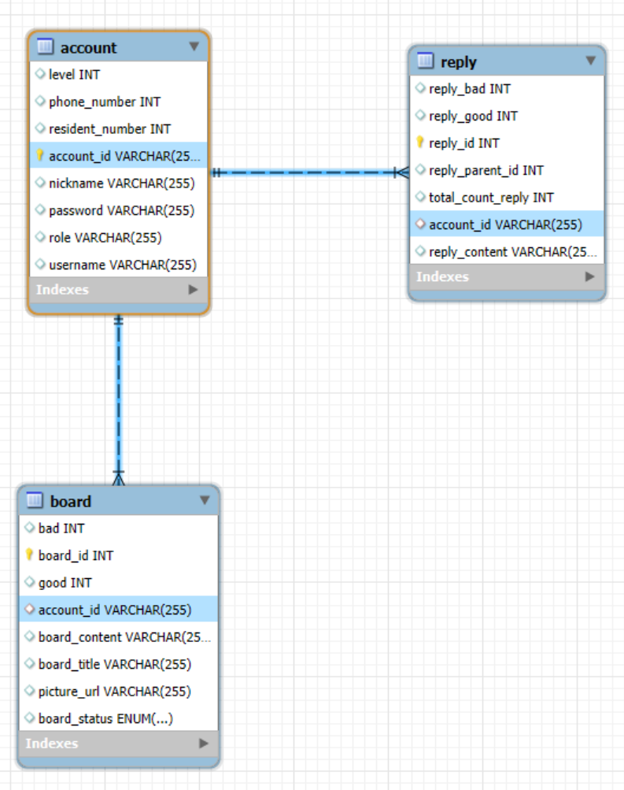

# 5 CHPP(Cat_drip Homepage Pair Programing)

1. [개요] 페어(파트너) 및 프로젝트 주제 소개
   김억근. 류민우 - 종합 게시판
   
3. [개요] 페어 협업 방식과 작업 기록 설명
4. [개요] 요구 사항/기능 설계, DB ERD 흐름 및 구조 설명
   트렐로 링크 참고 - https://trello.com/b/xVOlW8ao/%EC%BD%94%EB%93%9C%ED%95%98%EC%9A%B0%EC%8A%A4-%ED%8E%98%EC%96%B4-%ED%94%84%EB%A1%9C%EA%B7%B8%EB%9E%98%EB%B0%8D
   

5. [시연] 전체 구현 기능 실제 작동 시연

6. [회고] 기능 구현 과정에서 마주한 어려움과 해결 방법 공유

7. [회고] 프로젝트를 통해 구체화된 지식/기술 및 성장 포인트

8. [회고] 협업 중 느낀 점, 효과적인 부분과 개선할 점 논의

9. [회고] 팀 혹은 개인에게 주고 싶은 피드백 및 제언

10. [회고] 다음 프로젝트에서 적용하고 싶은 노하우
